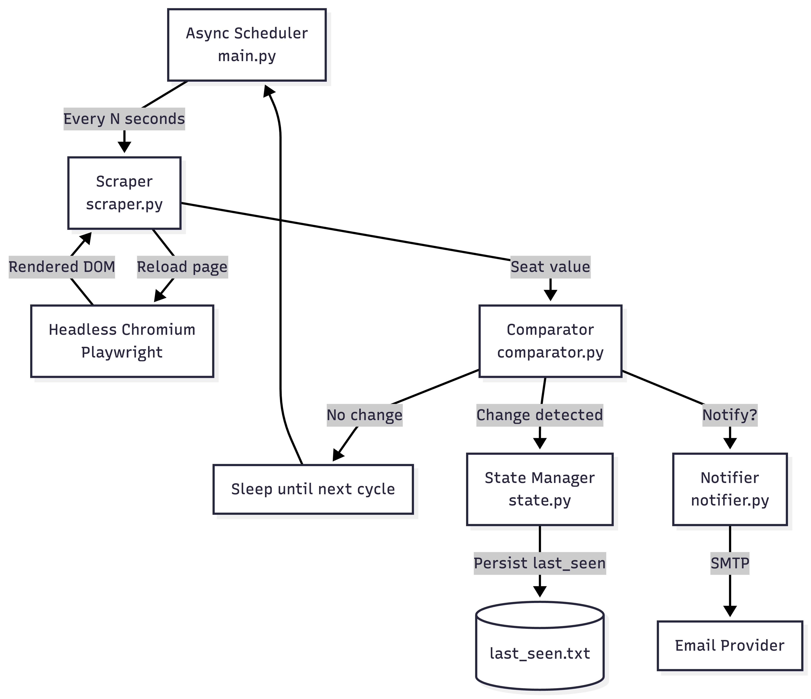
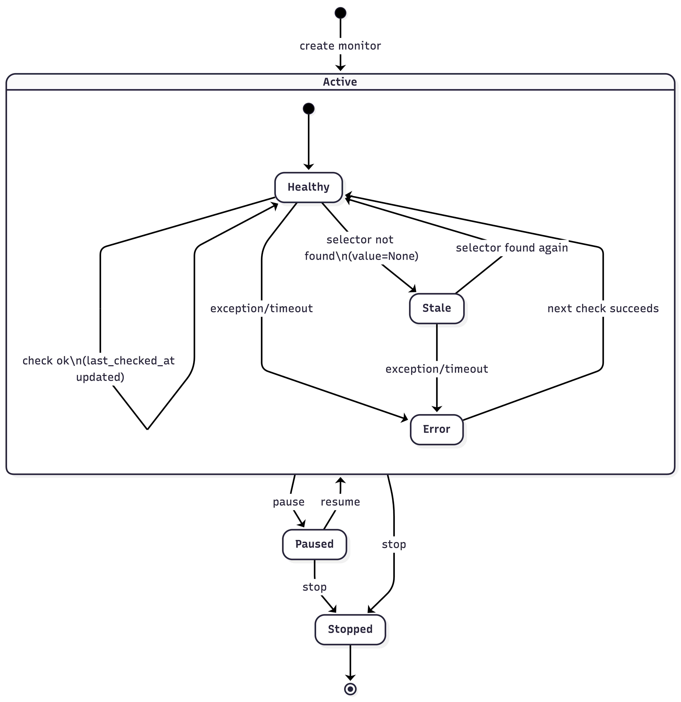

# Architecture Overview

This document describes the internal architecture of the Course Availability Tracker.

The system is designed as a **stateful monitoring service**, not a browser extension,
to reliably handle JavaScript-heavy pages.

---

## 🎯 Design Goals

- Reliability on dynamic pages
- Clear separation of concerns
- Observable system state
- Persisted monitoring state
- Easy extensibility into production

---

## 🧩 High-Level Architecture

---

## 🧱 Component Responsibilities

### API Layer
- **FastAPI Server**: Handles HTTP requests and serves static files
- **Routes**: Manages monitor lifecycle (create, list, delete, pause, resume)

### Service Layer
- **Monitor Manager**: Orchestrates monitoring tasks and state
- **Persistence Service**: Handles atomic disk storage of monitor configurations
- **Notification Store**: Logs and persists notification history

### Browser Layer
- **Playwright Browser**: Executes JavaScript-heavy pages and extracts data

---

## 🔄 Monitoring Lifecycle

---

## 🧠 State Model

### User Intent (Mode)
- `active`: monitoring runs
- `paused`: temporarily halted
- `stopped`: permanently removed

### System Health
- `healthy`: data fetched successfully
- `stale`: expected data not found
- `error`: exception during fetch

This separation avoids overloading a single "status" field.

## 🔁 Monitor State Model

---

## 💾 Persistence Strategy

- Stored as JSON on disk
- Atomic writes via temp files
- Includes:
  - monitor config
  - last seen value
  - timestamps
  - notification preferences
  - mode and health state

On restart:
- Monitors are restored
- Tasks are resumed
- UI reflects persisted state

---

## 📜 Notification History

Each detected seat change is logged with:
- monitor ID
- previous value
- new value
- timestamp

This enables:
- auditability
- UI history modal
- future analytics

---

## ⚠️ Failure Handling

- Page timeouts are caught
- Missing elements mark monitor as stale
- Errors do not crash the service
- Monitors continue independently

---

## 🚀 Scalability Path

Without architectural changes, this system can grow into:
- multi-user service
- DB-backed workers
- distributed task runners
- notification queues

The current design mirrors real production monitoring systems.