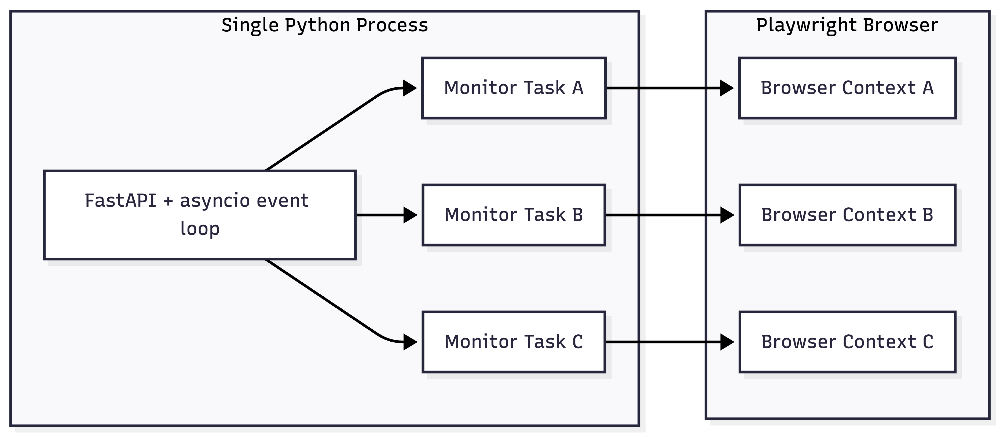

# Concurrency Model (Single Machine)

This document explains how the Course Availability Tracker runs **multiple course monitors concurrently on a single user's machine**.

The system is intentionally designed to run as a **single backend process**, not as multiple browser tabs or terminal instances.

---

## 🧠 High-Level Idea

- One backend process
- One asyncio event loop
- Many independent monitor tasks
- One headless browser with isolated contexts

All monitors run **at the same time** without blocking each other.

---

## 🧩 Execution Model Overview



---

## ⚙️ How Multiple Monitors Run Together

### 1. Single Server Process
When the user starts the app (via uvicorn):

- One Python process starts
- FastAPI initializes
- Playwright launches once
- There are no additional terminals or processes created per monitor.

### 2. Async Event Loop
FastAPI runs on an asyncio event loop.

Each monitor is started using:
```python
asyncio.create_task(monitor_loop(...))
```

This means:
- Every monitor is an independent coroutine
- Tasks yield control using await
- No task blocks another

### 3. Independent Monitoring Tasks
Each monitor task runs its own loop:
```
fetch → compare → notify → persist → sleep
```

Because sleep, browser navigation, and I/O are all await-based:
- Monitor A can be sleeping
- Monitor B can be fetching
- Monitor C can be sending email
- —all at the same time.

### 4. Browser Context Isolation
The system uses:
- One Playwright browser instance
- One browser context per monitor

Why this matters:
- No shared cookies
- No shared DOM state
- No navigation interference
- Much lower overhead than launching multiple browsers

This is similar to how real production scrapers work.

### 5. Failure Isolation
Each monitor task is isolated:
- A failure in one monitor:
  - Sets its health to error
  - Does not affect other monitors
  - Other monitors continue normally
- The system never crashes due to a single bad course page.

---

## 🔄 What Happens With 3 Monitors?

If a user adds 3 monitors via the UI:

❌ Not 3 terminals  
❌ Not 3 browsers  
❌ Not 3 servers  

Instead:

| Component | Count |
|-----------|-------|
| Python process | 1 |
| Event loop | 1 |
| Monitor tasks | 3 |
| Browser contexts | 3 |
| Browser instance | 1 |

---

## 💡 Why This Design Was Chosen

This concurrency model provides:
- Low resource usage
- Deterministic scheduling
- Easy persistence
- Clear observability
- Production-grade scalability

The same architecture pattern is used in:
- Job schedulers
- Web crawlers
- Monitoring agents
- Background worker systems

---

## 🚀 Scaling Path

This model can later evolve into:
- Multiple processes (per user)
- Distributed workers
- Queue-based scheduling
- Database-backed persistence

Without changing the core monitor logic.

---

## ✅ Summary

- Multiple monitors run concurrently on one machine
- Implemented using asyncio tasks
- Backed by one headless browser
- Isolated, efficient, and fault-tolerant

This design allows students to monitor many courses reliably without manual refreshes or browser hacks.