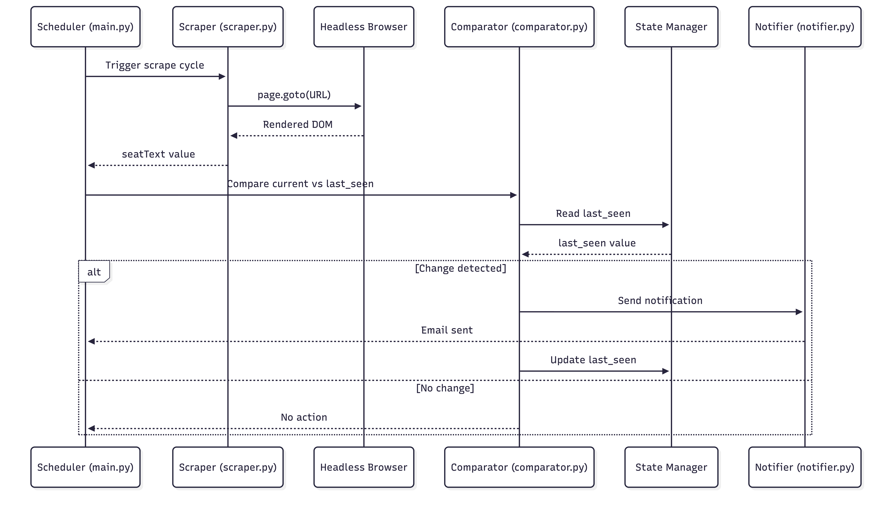
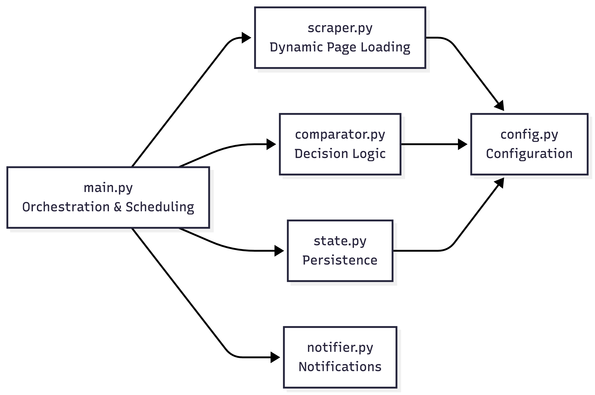

# Architecture Overview

This document describes the internal architecture and data flow of the
Course Seat Monitor system.

The project is intentionally structured as a **backend-style worker**
rather than a browser-based extension.

---

## 🎯 Design Goals

- Reliability on JavaScript-heavy pages
- Deterministic refresh behavior
- Clear separation of concerns
- Easy extensibility into a production service
- Minimal external dependencies

---

## 🧩 High-Level Flow

---

### Runtime Sequence Diagram

---

## 🧱 Component Dependencies

---
## 🔄 Execution Lifecycle

1. The scheduler triggers a monitoring cycle
2. The scraper:
   - Reloads the page using `page.goto`
   - Waits for client-side rendering to complete
   - Extracts the seat count from the DOM
3. The current value is compared with persisted state
4. If a change is detected:
   - A notification is sent
   - State is updated on disk
5. The system sleeps until the next cycle

---

## 🧱 Module Responsibilities

### `main.py`
- Application entry point
- Controls scheduling and retries
- Orchestrates scraping, comparison, and notification

### `scraper.py`
- Encapsulates all Playwright logic
- Handles dynamic page loading
- Executes DOM queries in the browser context

### `state.py`
- Persists previously observed seat values
- Prevents duplicate notifications
- Designed to be easily replaced by a database or cache

### `notifier.py`
- Sends email notifications via SMTP
- Abstracted to allow future notification channels

### `config.py`
- Centralized configuration
- Loads environment variables
- Separates runtime configuration from logic

---

## 🧠 Why Headless Browsing?

Many university registration systems rely on:
- Client-side rendering
- Asynchronous API calls
- DOM replacement after page load

Static HTTP requests and browser extensions are unreliable in these cases.

Using a headless browser ensures:
- JavaScript execution completes
- DOM state matches what a real user sees
- Consistent and repeatable scraping behavior

---

## 🔁 State Management Strategy

- State is stored locally in a text file
- State is loaded once at startup
- State is updated only on detected changes
- This minimizes I/O while maintaining correctness.

The design intentionally mirrors how production monitoring workers
manage state before migrating to databases or distributed caches.

---

## 🚀 Scalability Considerations

This architecture can be extended to:
- Monitor multiple courses per worker
- Run multiple workers in parallel
- Store state in Redis or a database
- Expose a REST API for user management

The current design prioritizes correctness and clarity over premature scaling.

---

## 🧪 Failure Handling

- Timeouts are caught and logged
- Temporary page failures do not crash the service
- Missing state files are handled gracefully

---

## 📌 Summary

The Course Seat Monitor is a small but well-structured backend system that
demonstrates:
- Real-world scraping challenges
- Asynchronous I/O handling
- Stateful change detection
- Clean modular design

The architecture is intentionally designed to scale into a production-grade
monitoring service with minimal refactoring.